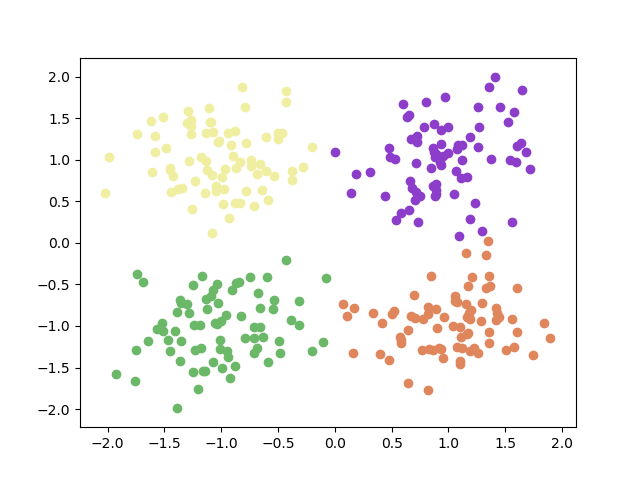

Mean-shift clustering algorithm in Python using numpy only.    

Running the code: ```python mean-shift.py```   

```python
import numpy as np
import random

STOP_THRESHOLD = 1e-4
CLUSTER_THRESHOLD = 1e-1

def distance(a, b):
    return np.linalg.norm(np.array(a) - np.array(b))

def gaussian_kernel(distance, bandwidth):
    return (1 / (bandwidth * np.sqrt(2 * np.pi))) * np.exp(-0.5 * ((distance / bandwidth)) ** 2)

class MeanShift(object):
    def __init__(self, kernel=gaussian_kernel):
        self.kernel = kernel

    def fit(self, points, kernel_bandwidth):

        shift_points = np.array(points)
        shifting = [True] * points.shape[0]

        while True:
            max_dist = 0
            for i in range(0, len(shift_points)):
                if not shifting[i]:
                    continue
                p_shift_init = shift_points[i].copy()
                shift_points[i] = self._shift_point(shift_points[i], points, kernel_bandwidth)
                dist = distance(shift_points[i], p_shift_init)
                max_dist = max(max_dist, dist)
                shifting[i] = dist > STOP_THRESHOLD

            if(max_dist < STOP_THRESHOLD):
                break
        cluster_ids = self._cluster_points(shift_points.tolist())
        return shift_points, cluster_ids

    def _shift_point(self, point, points, kernel_bandwidth):
        shift_x = 0.0
        shift_y = 0.0
        scale = 0.0
        for p in points:
            dist = distance(point, p)
            weight = self.kernel(dist, kernel_bandwidth)
            shift_x += p[0] * weight
            shift_y += p[1] * weight
            scale += weight
        shift_x = shift_x / scale
        shift_y = shift_y / scale
        return [shift_x, shift_y]

    def _cluster_points(self, points):
        cluster_ids = []
        cluster_idx = 0
        cluster_centers = []

        for i, point in enumerate(points):
            if(len(cluster_ids) == 0):
                cluster_ids.append(cluster_idx)
                cluster_centers.append(point)
                cluster_idx += 1
            else:
                for center in cluster_centers:
                    dist = distance(point, center)
                    if(dist < CLUSTER_THRESHOLD):
                        cluster_ids.append(cluster_centers.index(center))
                if(len(cluster_ids) < i + 1):
                    cluster_ids.append(cluster_idx)
                    cluster_centers.append(point)
                    cluster_idx += 1
        return cluster_ids


from sklearn.datasets.samples_generator import make_blobs
import matplotlib.pyplot as plt 

def colors(n):
  ret = []
  for i in range(n):
    ret.append((random.uniform(0, 1), random.uniform(0, 1), random.uniform(0, 1)))
  return ret

def main():
    centers = [[-1, -1], [-1, 1], [1, -1], [1, 1]]
    X, _ = make_blobs(n_samples=300, centers=centers, cluster_std=0.4)

    mean_shifter = MeanShift()
    _, mean_shift_result = mean_shifter.fit(X, kernel_bandwidth=0.5)

    np.set_printoptions(precision=3)
    print('input: {}'.format(X))
    print('assined clusters: {}'.format(mean_shift_result))
    color = colors(np.unique(mean_shift_result).size)

    for i in range(len(mean_shift_result)):
        plt.scatter(X[i, 0], X[i, 1], color = color[mean_shift_result[i]])
    plt.show()

if __name__ == '__main__':
    main()
```



input: [[-0.85  -1.04 ]   
 [ 1.18  -1.12 ]   
 [ 1.237  1.242]   
 [ 1.401 -1.81 ]   
 [ 0.999 -0.518]   
 [-1.013 -1.112]   
 [-1.259 -0.561]   
 [-0.878  0.884]   
 [ 0.902 -1.478]   
 [-0.911  0.548]   
 [-0.888  0.892]   
 [-0.204 -1.064]   
 [-1.543 -0.721]   
 [ 1.056  0.654]   
 [ 1.374  1.273]   
 [-1.571 -1.703]   
 [ 1.169 -1.286]   
 [ 1.271  0.583]   
 [-0.147 -1.563]   
 [ 1.1    0.999]   
 [-1.139 -0.685]   
 [-1.255  1.042]   
 [ 0.672 -1.033]   
 [ 1.361 -0.67 ]   
 [-1.888 -1.148]   
 [-0.76   1.065]   
 [-0.159 -0.968]   
 [ 1.009 -0.796]   
 [-0.622  1.247]   
 [ 0.536 -0.617]   
 [ 1.399 -0.602]   
 [-1.407  1.43 ]   
 [-0.188  0.48 ]   
 [-0.9    0.921]   
 [-0.701  0.851]   
 [-1.361  1.358]   
 [-1.063  0.896]   
 [-1.083  1.684]   
 [-1.213 -0.529]   
 [ 0.759 -0.613]   
 [ 1.371  0.4  ]   
 [ 0.864  1.234]   
 [ 0.932 -1.609]   
 [ 1.146  0.124]   
 [-1.107  1.681]   
 [ 1.497  0.674]   
 [ 1.227  0.79 ]   
 [ 0.761 -1.544]   
 [-1.011  0.883]   
 [ 0.964  1.078]   
 [-0.634  1.341]   
 [-1.513 -0.867]   
 [-1.131  2.097]   
 [-1.065  0.929]   
 [-0.948  0.879]   
 [-1.152 -1.273]   
 [-1.179  0.645]   
 [ 0.863  1.481]   
 [-1.649 -1.443]   
 [-0.891  1.023]   
 [ 1.124 -1.047]   
 [-0.927 -0.732]   
 [ 1.49  -0.901]   
 [ 1.019 -1.053]   
 [-1.675 -0.241]   
 [ 0.992 -0.607]   
 [-1.015  0.361]   
 [-0.016  1.137]   
 [ 1.098  1.026]   
 [ 0.782  0.456]   
 [-0.732 -1.254]   
 [-0.626  0.743]   
 [-0.513  0.378]   
 [-1.042 -0.939]   
 [ 1.491 -0.985]   
 [-1.021 -0.62 ]   
 [ 0.42  -0.923]   
 [ 1.037 -0.898]   
 [ 1.074 -0.939]   
 [ 1.111  0.956]   
 [ 0.248  0.263]   
 [ 1.198  1.069]   
 [-0.859 -0.827]   
 [-1.053 -0.587]   
 [-0.838 -1.623]   
 [ 1.075  0.723]   
 [ 1.07  -0.577]   
 [-0.709 -0.885]   
 [-0.534  0.668]   
 [ 1.313  0.372]   
 [ 1.053  0.912]   
 [ 1.131  1.721]   
 [ 0.19   1.181]   
 [ 0.452  1.481]   
 [ 1.04  -0.222]   
 [-0.763 -0.846]   
 [ 0.929  0.516]   
 [-0.947 -1.392]   
 [ 0.754  0.907]   
 [ 0.766  0.369]   
 [-0.409  0.538]   
 [-0.775 -1.44 ]   
 [-0.778 -0.587]   
 [-0.885  1.292]   
 [ 0.998 -0.935]   
 [-0.795 -0.58 ]   
 [ 1.334 -0.782]   
 [-0.772 -1.265]   
 [ 0.817  0.862]   
 [ 0.634 -1.103]   
 [-0.149 -0.499]   
 [-0.787 -0.145]   
 [-0.551 -0.736]   
 [-1.375  1.699]   
 [-1.067 -0.218]   
 [ 0.932  1.124]   
 [ 1.624 -1.108]   
 [-0.153  0.479]   
 [-1.123  0.658]   
 [-1.452  1.891]   
 [ 0.423  0.816]   
 [-0.853  1.39 ]   
 [ 0.797 -0.329]   
 [-1.119  1.05 ]   
 [ 0.529  1.262]   
 [-0.13  -1.086]   
 [ 0.84  -1.95 ]   
 [ 0.88   0.622]   
 [-1.51  -0.865]   
 [-1.039 -1.077]   
 [-1.197  1.792]   
 [-1.306 -1.115]   
 [ 0.879  0.779]   
 [ 1.359  1.382]   
 [ 0.817 -0.795]   
 [ 1.017  0.313]   
 [ 1.113 -1.096]   
 [ 0.529 -1.83 ]   
 [-0.938 -1.468]   
 [ 0.806  1.265]   
 [-0.486  0.927]   
 [ 0.469 -1.098]   
 [-1.271  1.306]   
 [ 0.903  0.863]   
 [ 1.118 -0.917]   
 [ 0.285 -1.37 ]   
 [-1.247  1.127]   
 [-0.667 -1.022]   
 [ 0.81  -1.452]   
 [ 0.951  0.94 ]   
 [-0.394  0.65 ]   
 [-0.909  1.059]   
 [-0.645  1.083]   
 [ 0.846  0.862]   
 [-0.942 -0.647]   
 [ 1.277 -0.722]   
 [-0.374  1.118]   
 [ 0.86  -0.822]   
 [ 0.454  1.002]   
 [ 0.943 -0.916]   
 [ 0.929  0.51 ]   
 [-1.021  1.706]   
 [ 1.496  1.037]   
 [ 0.893 -1.725]   
 [ 0.496  1.089]   
 [ 1.039  1.345]   
 [-0.619  1.22 ]   
 [ 0.658 -1.435]   
 [ 0.539  0.672]   
 [-0.656 -1.5  ]   
 [-1.534 -0.861]   
 [-0.546  0.488]   
 [-1.034 -1.112]   
 [ 1.08  -0.936]   
 [-0.889 -1.546]   
 [ 0.466  0.57 ]   
 [-1.238 -0.899]   
 [-0.874 -1.226]   
 [ 1.174 -0.352]   
 [ 1.26  -0.771]   
 [ 1.292 -0.988]   
 [-0.777  1.317]   
 [-1.073 -1.383]   
 [-1.27   0.792]   
 [ 0.333 -0.69 ]   
 [ 1.612 -1.205]   
 [-0.015 -1.212]   
 [ 0.932  0.66 ]   
 [ 0.608 -1.019]   
 [ 0.918  1.652]   
 [ 0.711  0.92 ]   
 [-0.725 -0.714]   
 [ 1.077 -0.629]   
 [ 0.755  1.203]   
 [-1.658 -0.685]   
 [ 0.559 -0.815]   
 [-0.298 -1.018]   
 [ 1.038 -0.451]   
 [ 0.821 -0.965]   
 [ 0.98  -0.593]   
 [-1.011  0.4  ]   
 [ 1.692 -1.18 ]   
 [ 0.702  0.221]   
 [ 0.838  1.06 ]   
 [-0.866 -0.99 ]   
 [-1.425  0.85 ]   
 [ 1.494 -0.92 ]   
 [ 0.302 -0.447]   
 [-1.406 -1.094]   
 [ 0.058  1.487]   
 [ 1.462  1.377]   
 [-0.543  0.792]   
 [ 1.279  1.664]   
 [-0.771 -1.308]   
 [ 0.729  0.887]   
 [ 1.318  1.327]   
 [ 0.755 -1.669]   
 [ 0.191  1.03 ]   
 [-1.456  0.958]   
 [ 0.575  0.58 ]   
 [ 1.037 -1.538]   
 [ 0.689 -1.394]   
 [ 1.788 -1.26 ]   
 [ 1.263  0.947]   
 [ 1.338 -0.793]   
 [-0.869 -0.731]   
 [ 1.397  1.799]   
 [-0.954  0.928]   
 [ 0.447  1.386]   
 [-1.465 -1.047]   
 [ 0.291  1.085]   
 [ 1.162  1.572]   
 [-1.04   0.92 ]   
 [-2.036  0.946]   
 [ 1.47  -1.533]   
 [ 1.495 -1.543]   
 [-2.13   0.812]   
 [-0.194 -1.708]   
 [-1.065 -0.776]   
 [-1.459  1.539]   
 [-1.768 -1.475]   
 [ 0.804  1.155]   
 [-0.257 -0.983]   
 [ 1.167 -0.916]   
 [-1.176  0.248]   
 [-0.916 -0.437]   
 [-0.758  0.918]   
 [-0.71  -1.267]   
 [-1.286  1.359]   
 [-0.666 -1.596]   
 [-0.058 -1.474]   
 [-0.674  0.773]   
 [ 0.407 -0.758]   
 [ 1.051  1.504]   
 [ 1.859  0.66 ]   
 [-0.935  0.658]   
 [ 1.424  1.569]   
 [-0.842  1.067]   
 [-0.238 -1.187]   
 [-1.396 -1.26 ]   
 [ 0.768  0.55 ]   
 [-1.264  1.319]   
 [ 0.909  0.843]   
 [ 1.167 -1.172]   
 [-1.431  0.959]   
 [-0.991  1.   ]   
 [-0.746 -0.587]   
 [-0.766  0.828]   
 [-0.997 -0.507]   
 [ 1.729  1.521]   
 [ 1.18  -0.506]   
 [-0.87  -1.23 ]   
 [ 0.899 -0.774]   
 [ 1.271 -0.883]   
 [ 1.774  1.267]   
 [-1.133  1.384]   
 [ 1.08   0.049]   
 [-1.048  1.328]   
 [-0.709  0.456]   
 [-1.007  0.682]   
 [-1.034  0.169]   
 [-0.287 -0.774]   
 [ 1.314 -1.793]   
 [-1.142 -1.424]   
 [ 0.742 -1.323]   
 [-1.032 -0.882]   
 [ 0.436  1.276]   
 [-1.411 -0.476]   
 [-1.335 -0.059]   
 [ 0.675 -1.607]   
 [-0.496  1.037]   
 [-0.971 -1.047]   
 [-0.33   1.282]   
 [-0.963  0.484]   
 [ 0.95   0.699]   
 [-0.443  0.828]   
 [-1.212 -1.605]   
 [-1.479 -0.598]   
 [-1.121 -0.719]   
 [-0.511  1.253]]   
 
assined clusters: [0, 1, 2, 1, 1, 0, 3, 1, 3, 2, 0, 0, 2, 3, 2, 0, 2, 0, 3, 1, 1, 1, 0, 0, 2, 2, 1, 2, 1, 0, 1, 2, 2, 2, 0, 3, 2, 1, 0, 2, 0, 1, 2, 0, 2, 2, 3, 1, 0, 2, 2, 1, 2, 2, 3, 2, 3, 3, 0, 2, 2, 0, 0, 1, 3, 2, 1, 3, 2, 1, 1, 0, 1, 0, 0, 1, 0, 2, 3, 3, 2, 2, 3, 3, 1, 0, 1, 0, 2, 3, 1, 2, 0, 2, 1, 1, 3, 2, 3, 2, 0, 1, 3, 3, 1, 0, 3, 2, 3, 3, 2, 3, 0, 0, 3, 0, 3, 1, 1, 0, 0, 1, 0, 0, 0, 1, 3, 3, 1, 0, 0, 2, 1, 0, 1, 3, 2, 2, 1, 3, 0, 3, 2, 2, 0, 2, 3, 3, 3, 2, 1, 1, 0, 2, 2, 3, 3, 0, 0, 1, 1, 1, 1, 2, 3, 1, 3, 0, 0, 3, 2, 3, 3, 0, 0, 3, 0, 0, 3, 2, 1, 0, 2, 0, 0, 2, 1, 1, 1, 0, 3, 2, 2, 3, 3, 2, 2, 1, 2, 3, 1, 3, 1, 0, 3, 3, 2, 3, 1, 3, 0, 3, 1, 1, 3, 0, 3, 0, 0, 1, 1, 0, 3, 1, 0, 1, 3, 2, 1, 0, 0, 1, 1, 0, 3, 2, 1, 1, 0, 3, 1, 3, 1, 3, 0, 2, 2, 1, 2, 0, 1, 0, 1, 2, 3, 2, 0, 2, 1, 2, 1, 2, 0, 1, 2, 1, 1, 0, 2, 2, 1, 0, 2, 3, 0, 0, 3, 3, 3, 1, 1, 3, 3, 3, 2, 2, 0, 1, 1, 3, 3, 3, 2, 2, 3, 3, 3, 3, 0, 2]
